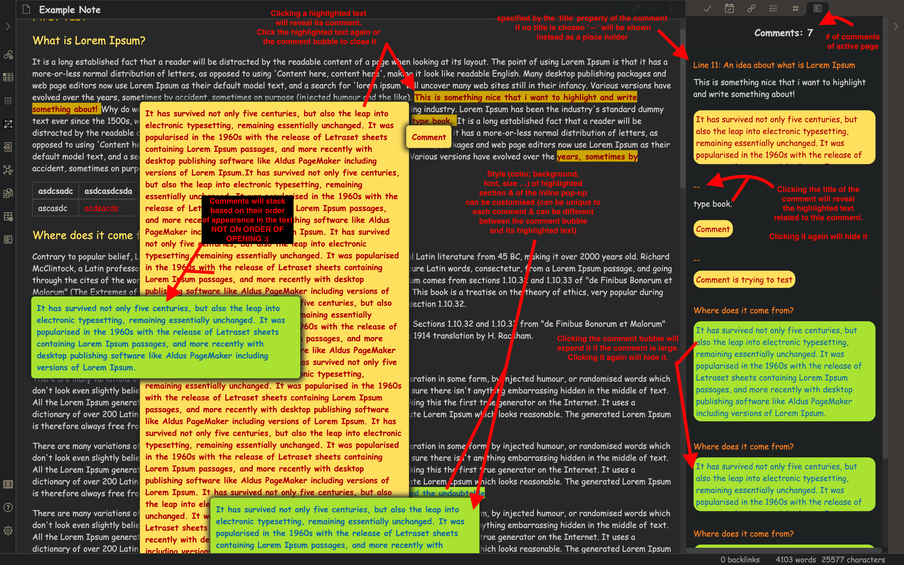

# Obsidian Comments Plugin

## Pluging features

**_Brief Description:_** PDF comments for obsidian notes

**_Detailed Description:_**
1. Commend that adds a comment syntax for the selected text (in edit mode)
2. Selected text will be highlighted with a certain text color & background color in preview mode
3. Clicking the highlighted text in preview mode will reveal a pop-up containing the comment related to it
4. A side panel that lists all comments for the current active note

## Usage

### Insert a comment:
1. highlight the text that you want to add a comment to
2. cmd/ctrl + p -> 'add comment' command -> enter
3. the selected text will be replaced with the following:

```<label class="ob-comment" title="..." style="..."> SELECTED TEXT <input type="checkbox"> <span> COMMENT </span></label>```

- binding the add comment to a hotkey (settings -> hotkeys) can make its usage faster e.g. cmd/ctrl + C

## Example



Comment properties:
> Comment text - text that will be shown when the highlighted text of this comment is clicked in preview mode. The text bubble will remain open until it is clicked again or the highlighted text that spawned it is clicked. 
> Comment buble style - the style can be 

The following can be specified for each comment:
 
  2. Comment title


## To-Do:
- Find a way to make links work from sidepanel to jump to section of origin
- Sticky better display of comment pop-ups
