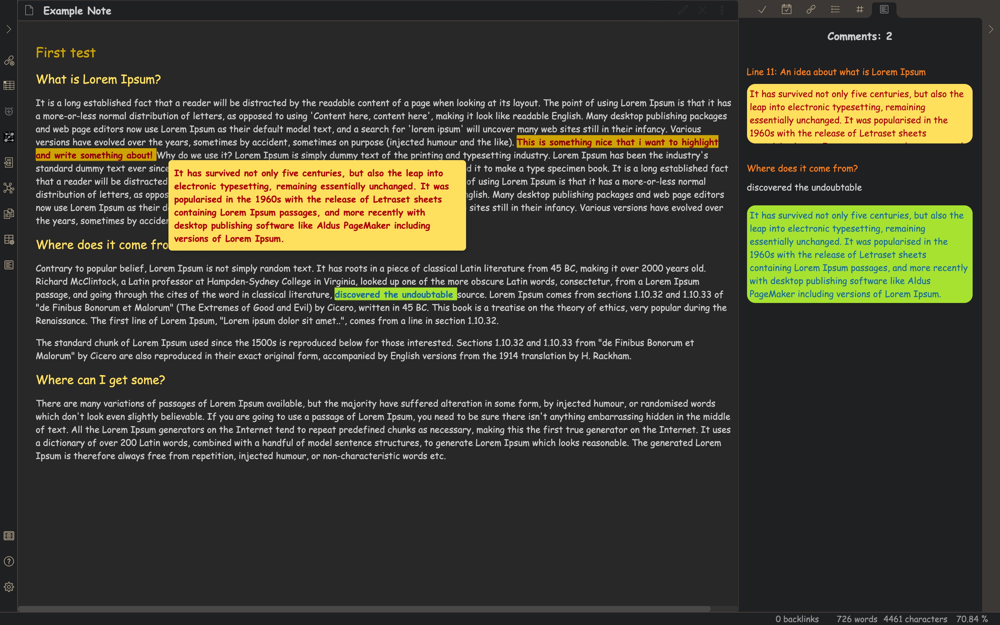

# obsidian-comments-plugin

UPDATE README <<<!!!!

## Adding comments:

```
<label class="ob-comment" title="..." style="..."> highlighted text <input type="checkbox"> <span> Comment </span>

<label class="ob-comment" title="This is the title to show in sidebar - it is hidden in the in-line page and it is optional!"> highlighted text - this text will be highlighted in preview mode and if clicked upon will cause a pop-up to show up containing the contents of the comment. <input type="checkbox"> <span> Comment pop-up  test that will appear when clicked! </span></label>
```

## Example



## To-Do:
- Adjust Css for inline tooltip to prevent it from causing the horizantal overflow and showing in-line instead if possible [DONE]
- Re-write code in Typescript [DONE]
- Add Roll-up and other info files [DONE]
- Find a way to make links work from sidepanel to jump to section of origine
